# intakeDeviceComplaint FlowService Documentation

## Overview

The `intakeDeviceComplaint` service is a comprehensive medical device complaint intake workflow that orchestrates multiple API calls to process device complaints, determine quality review requirements, and maintain audit trails.

## Service Information

- **Service Name**: `intakeDeviceComplaint`
- **Package**: `project.acuviademointegrations.integrations`
- **Type**: FlowService
- **Purpose**: Process medical device complaints with automated quality review determination

## Input Parameters

| Parameter | Type | Required | Description |
|-----------|------|----------|-------------|
| `requestId` | String | Yes | Unique identifier for the complaint request |
| `hospitalId` | String | No | Hospital or facility identifier |
| `reportedBy` | String | No | Name or ID of person reporting the complaint |
| `deviceIdentifier` | String | Yes | UDI or device identifier |
| `serialNumber` | String | Yes | Device serial number |
| `lotNumber` | String | No | Manufacturing lot number |
| `severity` | String | Yes | Complaint severity level (e.g., "high", "medium", "low") |
| `description` | String | No | Detailed description of the complaint |

## Output Parameters

| Parameter | Type | Description |
|-----------|------|-------------|
| `status` | String | "SUCCESS" or "FAILURE" |
| `requestId` | String | Echo of input requestId |
| `crmCaseId` | String | CRM case identifier created for the complaint |
| `qualityReviewDecision` | String | "true" if quality review required, "false" otherwise |
| `qmsQualityEventId` | String | QMS quality event ID (only when quality review required) |
| `notificationId` | String | Notification ID (only when quality review required) |
| `auditId` | String | Audit event identifier |
| `finalDecision` | String | Summary of the processing outcome |
| `errorMessage` | String | Error details (only on failure) |

## Business Logic

### Quality Review Determination

Quality review is **required** when either condition is met:
1. Complaint severity is "high"
2. Complaint count in last 30 days is greater than 1

### Processing Flow

> **Note:** To view the flowchart in VSCode, install the "Markdown Preview Mermaid Support" extension by Matt Bierner:
> 1. Press `Cmd+Shift+X` (Mac) or `Ctrl+Shift+X` (Windows/Linux)
> 2. Search for "Markdown Preview Mermaid Support"
> 3. Click Install
>
> **Alternative:** Open [`flowchart.html`](flowchart.html) in your web browser for an interactive flowchart view.

```mermaid
flowchart TD
    Start([Start: Receive Complaint])
    Init[Initialize URLs and Variables]
    DeviceLookup["GET Device Registry<br/>/device-registry/udi/deviceIdentifier"]
    DeviceCheck{Device Found?}
    Error[Error Handler]
    ExtractDevice[Extract Product Family & Model]
    
    HistoryLookup["GET Complaint History<br/>/complaints/history?serialNumber"]
    HistoryCheck{History Found?}
    ExtractHistory[Extract complaintCountLast30Days]
    
    CreateCRM["POST CRM Case<br/>/crm/cases"]
    CRMCheck{CRM Success?}
    ExtractCRM[Extract crmCaseId]
    
    QualityCheck{Quality Review<br/>Required?}
    QualityYes[Set qualityReviewRequired = true]
    QualityNo[Set qualityReviewRequired = false]
    
    CreateQMS["POST QMS Quality Event<br/>/qms/quality-events"]
    QMSCheck{QMS Success?}
    ExtractQMS[Extract qmsQualityEventId]
    
    SendNotification["POST Quality Review Notification<br/>/notifications/quality-review"]
    NotifyCheck{Notification Success?}
    ExtractNotify[Extract notificationId]
    
    WriteAudit["POST Audit Event<br/>/audit/events"]
    AuditCheck{Audit Success?}
    ExtractAudit[Extract auditId]
    
    Cleanup["Cleanup Pipeline<br/>Drop Temporary Variables"]
    Success[Return SUCCESS Response]
    End([End])
    
    ErrorMap[Map Error Details]
    ErrorReturn[Return FAILURE Response]
    
    Start --> Init
    Init --> DeviceLookup
    DeviceLookup --> DeviceCheck
    DeviceCheck -->|No| Error
    DeviceCheck -->|Yes| ExtractDevice
    
    ExtractDevice --> HistoryLookup
    HistoryLookup --> HistoryCheck
    HistoryCheck -->|No| Error
    HistoryCheck -->|Yes| ExtractHistory
    
    ExtractHistory --> CreateCRM
    CreateCRM --> CRMCheck
    CRMCheck -->|No| Error
    CRMCheck -->|Yes| ExtractCRM
    
    ExtractCRM --> QualityCheck
    QualityCheck -->|"severity == 'high'"| QualityYes
    QualityCheck -->|"complaintCount > 1"| QualityYes
    QualityCheck -->|No| QualityNo
    
    QualityYes --> CreateQMS
    CreateQMS --> QMSCheck
    QMSCheck -->|No| Error
    QMSCheck -->|Yes| ExtractQMS
    
    ExtractQMS --> SendNotification
    SendNotification --> NotifyCheck
    NotifyCheck -->|No| Error
    NotifyCheck -->|Yes| ExtractNotify
    
    ExtractNotify --> WriteAudit
    QualityNo --> WriteAudit
    
    WriteAudit --> AuditCheck
    AuditCheck -->|No| Error
    AuditCheck -->|Yes| ExtractAudit
    
    ExtractAudit --> Cleanup
    Cleanup --> Success
    Success --> End
    
    Error --> ErrorMap
    ErrorMap --> ErrorReturn
    ErrorReturn --> End
    
    style Start fill:#e1f5e1
    style End fill:#e1f5e1
    style Success fill:#c8e6c9
    style Error fill:#ffcdd2
    style ErrorReturn fill:#ffcdd2
    style QualityCheck fill:#fff9c4
    style DeviceCheck fill:#fff9c4
    style HistoryCheck fill:#fff9c4
    style CRMCheck fill:#fff9c4
    style QMSCheck fill:#fff9c4
    style NotifyCheck fill:#fff9c4
    style AuditCheck fill:#fff9c4
```



## API Integrations

### 1. Device Registry Lookup
- **Endpoint**: `GET /device-registry/udi/{deviceIdentifier}`
- **Purpose**: Retrieve device details including product family and model
- **Response Fields Used**: `deviceIdentifier`, `productFamily`, `model`, `manufacturer`, `status`

### 2. Complaint History Check
- **Endpoint**: `GET /complaints/history?serialNumber={serialNumber}`
- **Purpose**: Get historical complaint data for the device serial number
- **Response Fields Used**: `complaintCountLast30Days`, `complaintCountLast90Days`, `totalComplaints`

### 3. CRM Case Creation
- **Endpoint**: `POST /crm/cases`
- **Purpose**: Create a CRM case for every complaint
- **Request Payload**:
  ```json
  {
    "hospitalId": "string",
    "reportedBy": "string",
    "deviceIdentifier": "string",
    "serialNumber": "string",
    "lotNumber": "string",
    "severity": "string",
    "description": "string",
    "productFamily": "string",
    "model": "string",
    "source": "AcuVia Integration Services"
  }
  ```
- **Response Fields Used**: `caseId`, `status`

### 4. QMS Quality Event Creation (Conditional)
- **Endpoint**: `POST /qms/quality-events`
- **Purpose**: Create quality event when review is required
- **Condition**: Only called when `qualityReviewRequired == true`
- **Request Payload**:
  ```json
  {
    "source": "AcuVia Integration Services",
    "severity": "string",
    "eventType": "complaint",
    "deviceIdentifier": "string",
    "serialNumber": "string",
    "lotNumber": "string",
    "crmCaseId": "string",
    "reason": "string"
  }
  ```
- **Response Fields Used**: `qualityEventId`, `status`

### 5. Quality Review Notification (Conditional)
- **Endpoint**: `POST /notifications/quality-review`
- **Purpose**: Send high-priority notification to quality team
- **Condition**: Only called when QMS quality event is created
- **Request Payload**:
  ```json
  {
    "channel": "email",
    "priority": "high",
    "subject": "Quality Review Required",
    "message": "Quality review required for device {deviceIdentifier} serial {serialNumber}. CRM Case: {crmCaseId}, QMS Event: {qmsQualityEventId}",
    "recipients": ["quality-team@acuvia.com"]
  }
  ```
- **Response Fields Used**: `notificationId`, `status`

### 6. Audit Event Logging
- **Endpoint**: `POST /audit/events`
- **Purpose**: Write audit trail with decision and transaction IDs
- **Request Payload**:
  ```json
  {
    "requestId": "string",
    "serviceName": "intakeDeviceComplaint",
    "decision": "Quality review decision: {qualityReviewDecision}",
    "deviceIdentifier": "string",
    "lotNumber": "string",
    "serialNumber": "string",
    "payload": {
      "crmCaseId": "string",
      "qmsQualityEventId": "string",
      "notificationId": "string"
    }
  }
  ```
- **Response Fields Used**: `auditId`, `status`

## Error Handling

The service implements comprehensive error handling:

1. **TRY-CATCH Block**: Wraps all processing logic
2. **Error Capture**: Uses `pub.flow:getLastError` to capture error details
3. **Error Response**: Returns structured error response with:
   - `status`: "FAILURE"
   - `requestId`: Original request identifier
   - `errorMessage`: Error details from `lastError/error`
   - `finalDecision`: "Complaint intake failed"

## Pipeline Cleanup

The service performs thorough pipeline cleanup by dropping temporary variables:
- API endpoint URLs
- Intermediate response data (bytes, strings, documents)
- Extracted fields used only for processing
- Payload construction variables

This ensures only the required output parameters are returned to the caller.

## Usage Example

### Success Case - Quality Review Required

**Input:**
```json
{
  "requestId": "REQ-2024-001",
  "hospitalId": "HOSP-123",
  "reportedBy": "Dr. Smith",
  "deviceIdentifier": "08717648200274",
  "serialNumber": "SN-2024-001",
  "lotNumber": "LOT-2024-Q1",
  "severity": "high",
  "description": "Device malfunction during procedure"
}
```

**Output:**
```json
{
  "status": "SUCCESS",
  "requestId": "REQ-2024-001",
  "crmCaseId": "CASE-2024-001",
  "qualityReviewDecision": "true",
  "qmsQualityEventId": "QMS-2024-001",
  "notificationId": "NOTIF-2024-001",
  "auditId": "AUDIT-2024-001",
  "finalDecision": "Complaint intake completed successfully"
}
```

### Success Case - No Quality Review

**Input:**
```json
{
  "requestId": "REQ-2024-002",
  "hospitalId": "HOSP-456",
  "reportedBy": "Nurse Johnson",
  "deviceIdentifier": "08717648200274",
  "serialNumber": "SN-2024-002",
  "lotNumber": "LOT-2024-Q1",
  "severity": "low",
  "description": "Minor cosmetic issue"
}
```

**Output:**
```json
{
  "status": "SUCCESS",
  "requestId": "REQ-2024-002",
  "crmCaseId": "CASE-2024-002",
  "qualityReviewDecision": "false",
  "qmsQualityEventId": null,
  "notificationId": null,
  "auditId": "AUDIT-2024-002",
  "finalDecision": "Complaint intake completed successfully"
}
```

### Failure Case

**Input:**
```json
{
  "requestId": "REQ-2024-003",
  "deviceIdentifier": "INVALID-UDI",
  "serialNumber": "SN-2024-003",
  "severity": "medium"
}
```

**Output:**
```json
{
  "status": "FAILURE",
  "requestId": "REQ-2024-003",
  "errorMessage": "Device not found in registry",
  "finalDecision": "Complaint intake failed"
}
```

## Implementation Details

### Service Invocations

The service uses the following webMethods public services:

1. **`pub.client:http`** - HTTP client for REST API calls
   - Used 6 times for different API endpoints
   - Configured with 30-second timeout
   - Handles both GET and POST methods

2. **`pub.string:bytesToString`** - Byte array to string conversion
   - Used 6 times to convert HTTP response bytes to strings
   - UTF-8 encoding specified

3. **`pub.json:jsonStringToDocument`** - JSON parsing
   - Used 6 times to parse JSON responses into IData documents
   - Enables field extraction from API responses

4. **`pub.flow:getLastError`** - Error information retrieval
   - Used in CATCH block to capture error details

### Variable Substitution

The service uses variable substitution for dynamic URL and payload construction:
- URL construction: `set (variable) deviceLookupUrl = "%deviceRegistryUrl%%deviceIdentifier%"`
- JSON payload construction: Uses variable substitution within JSON strings

### Conditional Logic

- **IF statements** for quality review determination
- **Nested IF block** for conditional QMS and notification processing
- Ensures QMS quality event and notification are only created when required

## Performance Considerations

1. **Sequential Processing**: API calls are made sequentially to maintain data dependencies
2. **Timeout Configuration**: 30-second timeout for each HTTP call
3. **Error Fast-Fail**: Any API failure immediately triggers error handling
4. **Pipeline Efficiency**: Comprehensive cleanup reduces memory footprint

## Security Considerations

1. **HTTPS Endpoints**: All API calls use HTTPS protocol
2. **Audit Trail**: Complete audit logging of all decisions and transactions
3. **Error Information**: Error messages captured but sensitive data not exposed
4. **Input Validation**: Required fields enforced at service signature level

## Maintenance Notes

### Configuration
- API base URL: `https://acuvia-integration-services.onrender.com`
- Notification recipients: `quality-team@acuvia.com`
- Timeout: 30000 milliseconds (30 seconds)

### Dependencies
- Requires WmPublic package for pub.* services
- Requires network connectivity to AcuVia Integration Services
- Requires valid device identifiers in DeviceCare registry

### Future Enhancements
- Consider adding retry logic for transient failures
- Implement circuit breaker pattern for API resilience
- Add request/response logging for debugging
- Consider async processing for notification sending
- Add metrics collection for monitoring

## Related Services

- Device Registry API
- Complaint History API
- CRM Case Management API
- QMS Quality Event API
- Notification Service API
- Audit Event API

## Version History

| Version | Date | Author | Changes |
|---------|------|--------|---------|
| 1.0 | 2026-05-10 | Bob | Initial implementation with comprehensive complaint intake workflow |

## Support

For issues or questions regarding this service, contact the integration team or refer to the AcuVia Integration Services API documentation at:
https://acuvia-integration-services.onrender.com/openapi.json